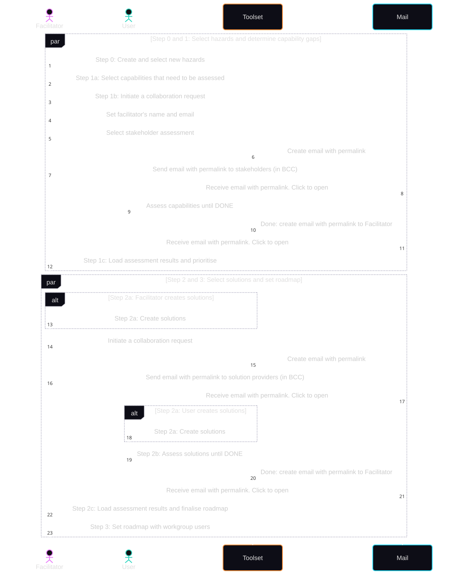

# DASF-toolset

DIREKTION-EU Assessment and Screening Framework (DASF)

The DASF toolset supports a transparent, structured, and repeatable assessment and screening process for disaster management organizations. It helps practitioners identify capability gaps, evaluate candidate solutions, and build implementation roadmaps.

## Purpose

The DIREKTION Assessment and Screening Framework provides a practical method to:

- Identify and prioritize capability gaps
- Assess potential solutions in a consistent way
- Connect assessment outcomes to actionable roadmaps

The toolset is designed for recurring use, so organizations can periodically reassess priorities, track progress, and update plans.

## Core Workflow

The application follows a 4-step process:

1. Initiation and Preparation (I&P): select and describe relevant hazard types for the assessment context.
2. Needs and Gaps Assessment (NGA): assess capabilities, identify gaps, and determine improvement urgency.
3. Solution Assessment (SA): evaluate candidate solutions, including maturity, compliance dimensions, usability, feasibility, and expected impact.
4. Roadmapping (RM): define implementation timelines and commitments for prioritized solutions.

## Key Features

- Session-based workflow for creating, opening, and continuing assessments
- Hazard selection and contextualization for scenario-focused assessments
- Capability and gap assessment with structured scoring
- Solution catalog and assessment including:
  - Technology readiness (TRL)
  - Compliance checks (for example cybersecurity, interoperability, GDPR, AI Act, fundamental rights, and sector constraints)
  - User, operational, and organizational fit
  - Expected legal, ethical, societal, and environmental impact
- Roadmapping support to translate findings into implementation actions
- Multi-language interface via translation dictionaries
- Role-aware behavior (regular users and facilitator/editor workflows)
- Collaboration support for workshop-style contribution and aggregation
- Local data persistence for browser-based use

## Collaboration and Facilitation

The toolset supports collaborative use in facilitated sessions. Facilitators can configure and guide the process, while participants contribute assessments and inputs. This supports both individual assessments and group workshops.



## Collaboration Testing

Real-world collaboration test scripts are available in `e2e/collaboration` using Bun + TypeScript.

The generated scenario covers two facilitator-led sessions:

- Facilitator Alpha runs one session with 3 users.
- Facilitator Bravo runs one session with 7 users.
- Both facilitators select multiple hazards and multiple capabilities.
- Users submit capability assessment feedback for selected capabilities.
- Facilitators can inspect accumulated and merged scores.
- Facilitator Alpha provides several prepared solutions and users assess them.
- Facilitator Bravo provides several prepared solutions and also invites users to suggest new solutions.
- The generated output includes a facilitator override example where a final score differs from participant consensus, plus a recorded justification note.

Run the scenario generator:

```bash
cd e2e/collaboration
bun run roundtrip
```

Use `inviteUrl` and per-user `patchUrl` entries from the generated JSON to drive collaboration workflow tests in the browser.

## Collaboration Screenshots

Capture milestone screenshots in:

- `e2e/collaboration/screenshots`

Recommended milestones:

- Facilitator filling out collaboration setup (modes, name, email)
- Invitee page opened from `inviteUrl`
- Merged results after loading patches (editable facilitator screen)
- Merged results in capability assessment view mode
- Facilitator override with justification note visible

## Project Structure

This repository is a pnpm workspace. The main application is located in:

- `packages/gui`: Mithril.js + TypeScript single-page application implementing the DASF workflow
- `packages/shared`: shared package workspace

Useful root-level files:

- `PLAN.md`: functional and workflow context
- `CLAUDE.md`: repository-specific development guidance

## Technology Stack

- TypeScript
- Mithril.js
- Meiosis state management pattern
- mithril-materialized UI components
- translate.js for internationalization
- Rspack/Vite-based build tooling (workspace package specific)

## Development

Install dependencies from the repository root:

```bash
pnpm i
```

Run the app in development mode:

```bash
pnpm start
```

Build all workspace packages:

```bash
pnpm run build
```

Clean workspace outputs:

```bash
pnpm run clean
```

## Funding and Attribution

In-app background attribution includes the following Horizon 2020 statement:

"This project has received funding from the European Union's Horizon 2020 research and innovation programme. Developed by TNO as part of the DIREKTION project."

The app also contains current DIREKTION attribution text for Horizon Europe grant information in the landing content.
