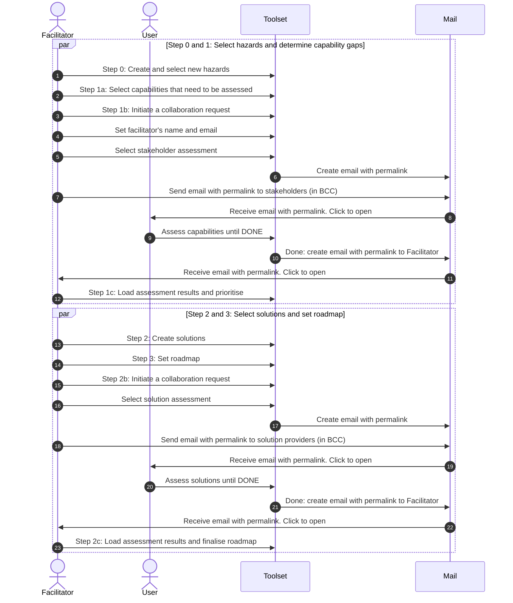

# Collaboration

A quick summary of how a facilitator can collaborate with users and solution providers during a workshop.

## Assumption

All data is stored locally in the browser, no data is stored on servers.

## Flow

